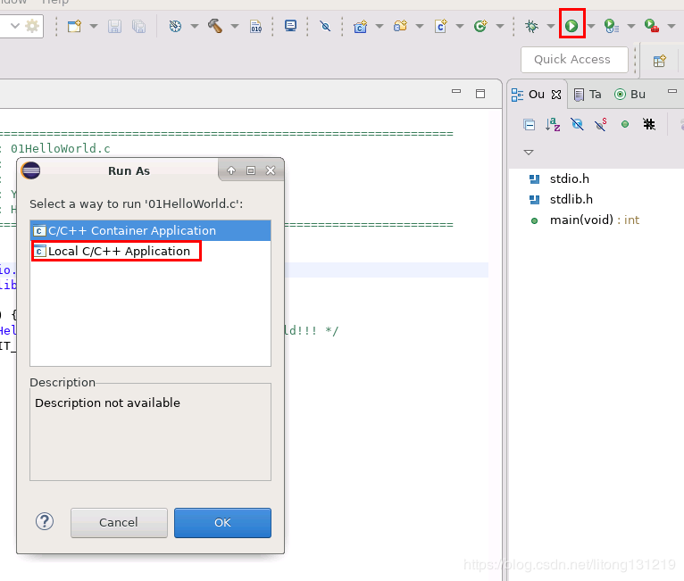

## docker-run-eclipse-cdt-1.0

#### 启动容器和连接容器

##### 启动容器

| docker run -dit --name=eclipse-cdt -p 20022:22 -p 23389:3389 -p 25901:5901 -e USER=litong -e PASSWORD=00000000 \\ -v /dv/eclipse/eclipse-workspace:/home/litong/eclipse-workspace litongjava/eclipse-cdt:1.0 |
|--------------------------------------------------------------------------------------------------------------------------------------------------------------------------------------------------------------|

或者

| docker run -dit --name=eclipse-cdt -p 10022:22 -p 13389:3389 -e USER=litong -e PASSWORD=00000000 \\ litongjava/eclipse-cdt:1.0 |
|--------------------------------------------------------------------------------------------------------------------------------|

##### 连接容器

ssh连接容器

使用任意ssh客户端连接容器

xrdp连接容器

在windows上执行下面的命令登录容器

| mstsc -v ip:23389 |
|-------------------|

在没有连接容器之前,容器上开启了3389和3350,连接容器之后,容器就开启了5910端口

第一次登录会提示选择面板,选择 Use default config

vnc连接容器

启动容器内的tigervncserver

容器默认并没有启动tigervncserver服务需要手动启动,启动命令如下

| vncserver :1 -geometry 1920x1080 -depth 24 |
|--------------------------------------------|

启动vncserver之后,就可以使用任意vnc客户端连接容器

#### 使用容器

##### 使用中文搜狗输入法

登录成功后执行fcitx-configtool--\>Input Method选择+号, 取消only show current
language选择sougou pinyin 添加

单击右上角键盘,选择sougou pinyin

按Ctrl+Space进行中英文输入法切换

##### 创建C Hello World

选工作空间

Eclipse启动成功

创建C项目

File--\>New--\>Other--\> C Project

选择工具链为LInux GCC,选择Project Type为Hello World ANSI Project

先点击工具栏锤子形状的按钮进行编译

点击工具栏运行按钮,选择 Local C/C++ Application

会出现项目的界面,不用做任何更改,直接选择run

运行成功

退出时一定要先关闭eclipse并注销,不要直接点
远程桌面连接工具的x,否则再次启动eclipse时会出现项目的问题

